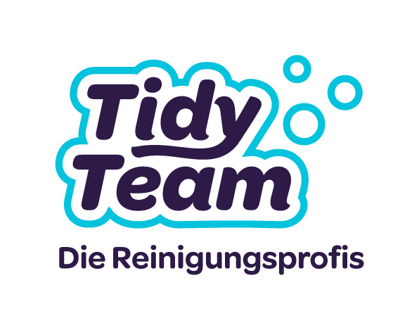

<!DOCTYPE html>
<html lang="de">
<head>
    <meta charset="UTF-8">
    <meta name="viewport" content="width=device-width, initial-scale=1.0">
    <title>Tidy Team – Reinigungsvertrag mit Abgabegarantie</title>
    
</head>
<body>

    <!-- Header -->
    

        
        <h1>Reinigungsvertrag mit Abgabegarantie</h1>
        
Bitte füllen Sie alle relevanten Felder aus

    

    <form id="tidyForm">

        <!-- 1 ─ Kundendaten -->
        

            <h2>👤 Kundendaten</h2>
            

                

                    <label for="besichtigung">Besichtigungstermin</label>
                    <input type="date" id="besichtigung">
                

            

            

                

                    <label for="anrede">Anrede</label>
                    <select id="anrede">
                        <option value="">— bitte wählen —</option>
                        <option>Herr</option>
                        <option>Frau</option>
                        <option>Firma</option>
                    </select>
                

                

                    <label for="vorname">Vorname</label>
                    <input type="text" id="vorname" placeholder="Max">
                

                

                    <label for="nachname">Nachname</label>
                    <input type="text" id="nachname" placeholder="Muster">
                

            

            

                

                    <label for="firma">Firma (optional)</label>
                    <input type="text" id="firma">
                

            

            

                

                    <label for="strasse">Strasse &amp; Nr.</label>
                    <input type="text" id="strasse" placeholder="Musterstrasse 12">
                

                

                    <label for="plz">PLZ</label>
                    <input type="text" id="plz" placeholder="8000">
                

                

                    <label for="ort">Ort</label>
                    <input type="text" id="ort" placeholder="Zürich">
                

            

            

                

                    <label for="telefon">Telefon</label>
                    <input type="tel" id="telefon" placeholder="+41 79 123 45 67">
                

                

                    <label for="email">E-Mail</label>
                    <input type="email" id="email" placeholder="max@muster.ch">
                

            

        

        <!-- 2 ─ Objektdaten -->
        

            <h2>🏠 Objektdaten</h2>
            

                

                    <label for="obj_strasse">Objektadresse (falls abweichend)</label>
                    <input type="text" id="obj_strasse">
                

                

                    <label for="obj_plz">PLZ / Ort</label>
                    <input type="text" id="obj_plz">
                

            

            

                

                    <label for="obj_typ">Objekttyp</label>
                    <select id="obj_typ">
                        <option value="">— bitte wählen —</option>
                        <option>Wohnung</option>
                        <option>Haus</option>
                        <option>Büro / Gewerbe</option>
                        <option>Praxis</option>
                        <option>Treppenhaus</option>
                        <option>Anderes</option>
                    </select>
                

                

                    <label for="zimmer">Wohnung / Zimmeranzahl</label>
                    <input type="number" id="zimmer" min="1" max="30">
                

                

                    <label for="flaeche">Wohnfläche (m²)</label>
                    <input type="number" id="flaeche" min="1">
                

            

            

                

                    <label for="stockwerk">Stockwerk</label>
                    <input type="text" id="stockwerk">
                

                

                    <label for="lift">Lift vorhanden</label>
                    <select id="lift">
                        <option value="">— bitte wählen —</option>
                        <option>Ja</option>
                        <option>Nein</option>
                    </select>
                

                

                    <label for="zugang">Schlüssel / Zugang</label>
                    <select id="zugang">
                        <option value="">— bitte wählen —</option>
                        <option>Kunde anwesend</option>
                        <option>Schlüssel hinterlegt</option>
                        <option>Schlüsselübergabe</option>
                        <option>Code / Badge</option>
                    </select>
                

            

            

                

                    <label for="preis">Preis (CHF)</label>
                    <input type="number" id="preis" step="0.05" min="0" placeholder="0.00">
                

            

        

        <!-- 3 ─ Termin & Preise -->
        

            <h2>📅 Termin &amp; Preise</h2>
            

                

                    <label for="datum_start">Reinigungstermin (Datum)</label>
                    <input type="date" id="datum_start">
                

                

                    <label for="abgabetermin">Abgabetermin (Datum)</label>
                    <input type="date" id="abgabetermin">
                

                

                    <label for="zeit_von">Uhrzeit von</label>
                    <input type="time" id="zeit_von">
                

                

                    <label for="zeit_bis">Uhrzeit bis</label>
                    <input type="time" id="zeit_bis">
                

            

            

                

                    <label for="auftragstyp">Auftragstyp</label>
                    <select id="auftragstyp">
                        <option value="">— bitte wählen —</option>
                        <option>Unterhaltsreinigung</option>
                        <option>Grundreinigung</option>
                        <option>Endreinigung / Umzug</option>
                        <option>Baureinigung</option>
                        <option>Fensterreinigung</option>
                        <option>Büroreinigung</option>
                        <option>Sonderreinigung</option>
                    </select>
                

                

                    <label for="turnus">Turnus</label>
                    <select id="turnus">
                        <option value="">— bitte wählen —</option>
                        <option>Einmalig</option>
                        <option>Wöchentlich</option>
                        <option>14-täglich</option>
                        <option>Monatlich</option>
                        <option>Nach Vereinbarung</option>
                    </select>
                

                

                    <label for="preismodell">Preismodell</label>
                    <select id="preismodell">
                        <option value="">— bitte wählen —</option>
                        <option>Stundenansatz</option>
                        <option>Pauschal</option>
                        <option>Nach Aufwand</option>
                    </select>
                

                

                    <label for="mwst">inkl. MwSt.</label>
                    <select id="mwst">
                        <option>Ja (8.1 %)</option>
                        <option>Nein</option>
                    </select>
                

            

        

        <!-- 4 ─ Leistungen (Original contract checklist) -->
        

            <h2>🧹 Leistungen</h2>
            

                <!-- Storen / Lamellen -->
                

                    Storen / Lamellen
                    

                        <label><input type="radio" name="l_storen" value="Ja"> Ja</label>
                        <label><input type="radio" name="l_storen" value="Nein"> Nein</label>
                    

                

                <!-- Fenster -->
                

                    Fenster
                    

                        <label><input type="radio" name="l_fenster" value="Ja"> Ja</label>
                        <label><input type="radio" name="l_fenster" value="Nein"> Nein</label>
                        <label>Stk. <input type="number" id="fenster_stk" min="0" max="99" style="width:55px;"></label>
                    

                

                <!-- WC / Bad -->
                

                    WC / Bad (Anzahl)
                    

                        <label>Stk. <input type="number" id="wc_stk" min="0" max="20" style="width:55px;"></label>
                    

                

                <!-- Waschmaschine / Tumbler -->
                

                    Waschmaschine / Tumbler
                    

                        <label><input type="radio" name="l_waschmaschine" value="Ja"> Ja</label>
                        <label><input type="radio" name="l_waschmaschine" value="Nein"> Nein</label>
                    

                

                <!-- Küche -->
                

                    Küche
                    

                        <label><input type="radio" name="l_kueche" value="Ja"> Ja</label>
                        <label><input type="radio" name="l_kueche" value="Nein"> Nein</label>
                    

                

                <!-- Balkon -->
                

                    Balkon
                    

                        <label><input type="radio" name="l_balkon" value="Ja"> Ja</label>
                        <label><input type="radio" name="l_balkon" value="Nein"> Nein</label>
                        <label>Anz. <input type="number" id="balkon_anz" min="0" max="10" style="width:55px;"></label>
                    

                

                <!-- Wintergarten -->
                

                    Wintergarten
                    

                        <label><input type="radio" name="l_wintergarten" value="Ja"> Ja</label>
                        <label><input type="radio" name="l_wintergarten" value="Nein"> Nein</label>
                    

                

                <!-- Kärcher -->
                

                    Kärcher
                    

                        <label><input type="radio" name="l_kaercher" value="Ja"> Ja</label>
                        <label><input type="radio" name="l_kaercher" value="Nein"> Nein</label>
                    

                

                <!-- Teppich -->
                

                    Teppich
                    

                        <label><input type="radio" name="l_teppich" value="Ja"> Ja</label>
                        <label><input type="radio" name="l_teppich" value="Nein"> Nein</label>
                    

                

                <!-- Keller -->
                

                    Keller
                    

                        <label><input type="radio" name="l_keller" value="Ja"> Ja</label>
                        <label><input type="radio" name="l_keller" value="Nein"> Nein</label>
                    

                

                <!-- Estrich -->
                

                    Estrich
                    

                        <label><input type="radio" name="l_estrich" value="Ja"> Ja</label>
                        <label><input type="radio" name="l_estrich" value="Nein"> Nein</label>
                    

                

                <!-- Garage -->
                

                    Garage
                    

                        <label><input type="radio" name="l_garage" value="Ja"> Ja</label>
                        <label><input type="radio" name="l_garage" value="Nein"> Nein</label>
                    

                

                <!-- Briefkasten -->
                

                    Briefkasten
                    

                        <label><input type="radio" name="l_briefkasten" value="Ja"> Ja</label>
                        <label><input type="radio" name="l_briefkasten" value="Nein"> Nein</label>
                    

                

                <!-- Boden -->
                

                    Boden (wischen, saugen)
                    

                        <label><input type="radio" name="l_boden" value="Ja"> Ja</label>
                        <label><input type="radio" name="l_boden" value="Nein"> Nein</label>
                    

                

                <!-- Staubwischen -->
                

                    Staubwischen
                    

                        <label><input type="radio" name="l_staub" value="Ja"> Ja</label>
                        <label><input type="radio" name="l_staub" value="Nein"> Nein</label>
                    

                

                <!-- Bügeln / Wäsche -->
                

                    Bügeln / Wäsche
                    

                        <label><input type="radio" name="l_buegeln" value="Ja"> Ja</label>
                        <label><input type="radio" name="l_buegeln" value="Nein"> Nein</label>
                    

                

            

        

        <!-- 5 ─ Extras -->
        

            <h2>⚙️ Extras</h2>
            

                <!-- Bezahlung -->
                

                    Bezahlung
                    

                        <label><input type="radio" name="bezahlung" value="Bar"> Bar</label>
                        <label><input type="radio" name="bezahlung" value="Twint"> Twint</label>
                    

                

                <!-- Übergabe dabei -->
                

                    Übergabe dabei
                    

                        <label><input type="radio" name="uebergabe" value="Ja"> Ja</label>
                        <label><input type="radio" name="uebergabe" value="Nein"> Nein</label>
                    

                

                <!-- Vollmacht -->
                

                    Vollmacht
                    

                        <label><input type="radio" name="vollmacht" value="Ja"> Ja</label>
                        <label><input type="radio" name="vollmacht" value="Nein"> Nein</label>
                    

                

            

        

        <!-- 6 ─ Bemerkungen + Diktierfunktion -->
        

            <h2>📝 Bemerkungen
                <button type="button" class="dictation-btn" id="dictBtn" title="Spracheingabe starten" onclick="toggleDictation()">🎤</button>
            </h2>
            <textarea id="bemerkungen" rows="5" placeholder="Zusätzliche Anmerkungen, Wünsche oder Sonderwünsche …"></textarea>
        

        <!-- 7 ─ Unterschriften (Tidy Team + Kunde) -->
        

            <h2>✍️ Unterschriften</h2>
            

                <!-- Tidy Team Signature -->
                

                    

                        <canvas id="signatureCanvasTT" class="sig-canvas"></canvas>
                        
Tidy Team

                    

                    

                        <button type="button" class="btn btn-outline" onclick="clearSignature('TT')" style="font-size:.85rem;padding:7px 16px;">Löschen</button>
                    

                

                <!-- Kunde Signature -->
                

                    

                        <canvas id="signatureCanvasKunde" class="sig-canvas"></canvas>
                        
Kunde

                    

                    

                        <button type="button" class="btn btn-outline" onclick="clearSignature('Kunde')" style="font-size:.85rem;padding:7px 16px;">Löschen</button>
                    

                

            

            

                

                    <label for="ort_datum">Ort / Datum</label>
                    <input type="text" id="ort_datum" placeholder="Zürich, 13.05.2026">
                

            

        

        <!-- 8 ─ Aktionen -->
        

            <h2 style="justify-content:center;">📤 Vertrag senden / speichern</h2>
            

                <button type="button" class="btn btn-primary" onclick="generatePDF()">📄 PDF erstellen</button>
                <button type="button" class="btn btn-blue" onclick="sendEmail()">✉️ Per E-Mail senden</button>
                <button type="button" class="btn btn-whatsapp" onclick="sendWhatsApp()">💬 WhatsApp senden</button>
                <button type="button" class="btn btn-outline" onclick="window.print()">🖨️ Drucken</button>
            

        

    </form>

    <!-- Company Footer -->
    

        <strong>Tidy Team GmbH</strong> 
        Freiestrasse 38, 8580 Amriswil 
        Tel: <a href="tel:+41787379716">078 737 97 16</a> · 
        E-Mail: <a href="mailto:info@tidy-team.ch">info@tidy-team.ch</a> · 
        Web: <a href="https://tidy-team.ch" target="_blank">tidy-team.ch</a> 
        UBS IBAN: CH84 0020 3203 1111 7301 A – 0203-1111 73.01A
    

<!-- ════════════════════════════════════════
     JavaScript
     ════════════════════════════════════════ -->

</body>
</html>
